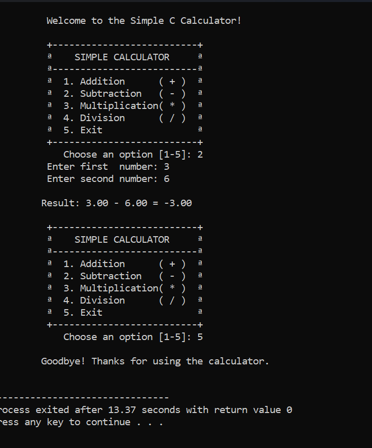

# 🧮 Simple Calculator in C

> A clean, menu-driven calculator built in C — my first real systems programming project.

---

## 📸 Preview



---

## 👋 About This Project

My name is **Muhammad Ramzan**. I built this Simple Calculator in C as part of my journey into low-level programming and systems development.

This might look like a small project to some people — but for me, it was a real challenge. Coming from higher-level languages, writing in C means you are responsible for everything. No automatic memory handling, no built-in safety nets. You have to think about every input, every edge case, every line of code. That is what made this project both frustrating and incredibly rewarding at the same time.

The idea was simple: build a calculator. But doing it *properly* in C — with clean functions, input validation, safe division, and a real menu system — that is where the actual learning happened.

---

## 💡 What This Project Does

This is a terminal-based calculator that runs in a loop and lets the user pick an operation from a menu. It keeps running until the user decides to exit.

**Supported operations:**
- ➕ Addition
- ➖ Subtraction
- ✖️ Multiplication
- ➗ Division (with zero protection)

---

## ⚙️ Features

- **Menu-driven interface** — clean numbered menu every time, no confusion
- **Switch-case routing** — each operation is handled in its own case, easy to read and follow
- **Modular functions** — `add()`, `subtract()`, `multiply()`, `divide()` are all separate functions, not dumped into `main()`
- **Division by zero protection** — the program catches it before calling the divide function and shows a proper error message instead of crashing
- **Input validation** — if you type letters instead of numbers, the program handles it gracefully and does not break
- **Input buffer flushing** — a common beginner mistake in C is leaving junk in the input buffer; this project handles that correctly
- **Decimal support** — uses `double` instead of `int`, so operations like `7 / 2` give `3.50` not `3`
- **Loop until exit** — the program stays open until the user chooses option 5, just like a real application

---

## 🛠️ How I Built It — 4 Commits

I built this project in 4 structured commits, each one adding a real layer to the program. This is how real development works — not writing everything at once.

| Commit | What I Did |
|--------|-----------|
| `feat: initial project setup and basic I/O structure` | Created the file, set up includes, wrote a basic `main()` that reads two numbers and prints them |
| `feat: added arithmetic operation functions` | Moved all math into separate named functions — `add()`, `subtract()`, `multiply()`, `divide()` |
| `feat: implement switch-case logic and user menu` | Added `printMenu()`, connected everything with a `switch-case`, wrapped it in a `do-while` loop |
| `fix: added input validation and division-by-zero protection` | Added `getOperands()` with `scanf` return checking, buffer flushing, division guard, and range validation |

---

## 😤 The Hard Parts

I want to be honest — this project was not easy for me at the start.

The hardest thing was **input validation in C**. In other languages you can just check if something is a number with a simple function. In C, `scanf` returns a value that tells you whether it worked, and if it fails, the bad input stays stuck in the buffer and breaks everything after it. I spent a lot of time figuring out why my program was going into an infinite loop — it was because I was not flushing the input buffer after a failed read.

The second hard part was **understanding why division by zero has to be caught before calling the function**, not inside it. It seemed like the same thing to me at first, but writing it in the `switch-case` before calling `divide()` keeps the math function clean and puts the error handling where it belongs — in the user-facing part of the code.

These are small things, but they taught me how C actually works at a deeper level than I expected.

---

## 🚀 How to Run It Yourself

**Requirements:** GCC compiler installed on your machine

**Step 1 — Clone the repo:**
```bash
git clone https://github.com/mramzan579/c-simple-calculator.git
cd c-simple-calculator
```

**Step 2 — Compile:**
```bash
gcc -Wall -Wextra -o calculator calculator.c
```

**Step 3 — Run:**
```bash
./calculator
```

> On Windows with MinGW: `gcc -Wall -Wextra -o calculator.exe calculator.c` then `calculator.exe`

---

## 📁 Project Structure

```
simple-calculator-c/
│
├── calculator.c     # Main source file — entire project lives here
└── README.md        # You are reading this


## 🧠 What I Learned

- How to write and call functions in C properly
- How `scanf` works and why you must check its return value
- Why flushing the input buffer (`while (getchar() != '\n')`) matters
- How `switch-case` with `do-while` creates a clean program loop
- The difference between writing code that works and writing code that is safe
- How to structure a project into commits that tell a story


## 📬 Connect With Me

If you are a client, recruiter, or fellow developer — feel free to reach out.

**Muhammad Ramzan**
- GitHub: https://github.com/mramzan579
- LinkedIn: https://www.linkedin.com/in/muhammad-ramzan-bb63233aa/
- Email: mramzan147800@gmail.com

<div align="center">
  <sub>Built with patience, debugging, and a lot of C compiler errors — by Muhammad Ramzan</sub>
</div>